# Platform Reference Architecture Diagrams and Component Flows

## Purpose

This document defines the visual systems-architecture and engineering-reference layer for the synthetic Microsoft 365 E5 / Microsoft Purview banking and financial-services simulation platform.

It provides text-based architecture diagrams, component responsibilities, data flows, trust boundaries, synthetic-data boundaries, deployment topology, and future-state architecture references.

All users, files, telemetry, prompts, incidents, customers, identifiers, financial records, HR records, legal matters, and cases are fictional and synthetic.

---

## Core Architecture Thesis

> The platform is a synthetic Microsoft 365 governance cyber-range. It manufactures fictional business content, simulates human collaboration, emits normalized telemetry, reconstructs timelines, and translates signals into executive, SOC, Purview, and AI-governance stories.

The architecture must preserve three boundaries:

1. Synthetic data boundary.
2. Demo/lab tenant boundary.
3. Production/customer-data exclusion boundary.

---

## Logical Architecture Overview

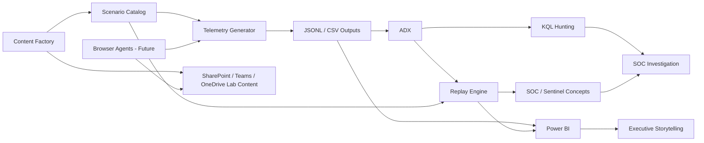

---

## Component Responsibility Matrix

| Component | Responsibility | MVP Required |
|---|---|---|
| Content Factory | generates synthetic documents, emails, chats, prompts, metadata | Partial |
| Persona Catalog | defines fictional users, roles, departments, behavior | Yes |
| Scenario Catalog | defines business scenarios and expected signals | Yes |
| Telemetry Generator | creates normalized synthetic events | Yes |
| Risk Scoring Engine | assigns synthetic risk scores and severities | Yes |
| Replay Engine | reconstructs ordered scenario timelines | Yes |
| ADX Layer | ingests JSONL and supports KQL hunting | P1 |
| Power BI Layer | provides executive and analyst dashboards | Yes |
| KQL Detection Layer | supports hunting and replay validation | P1 |
| Browser Agents | performs visible Microsoft 365 actions | Future |
| Sentinel Layer | maps detections to incidents and SOC workflows | Future |
| Validation Layer | enforces schema, safety, and replay correctness | Yes |
| Commercial Layer | packages demos into services and workshops | P2 |

---

## Synthetic Content Flow

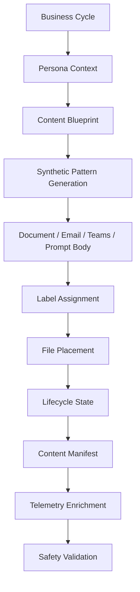

### Output

```text
content-output/documents
content-output/emails
content-output/teams-threads
content-output/ai-prompts
content-output/metadata/generated-content-manifest.json
```

---

## Telemetry Generation Flow

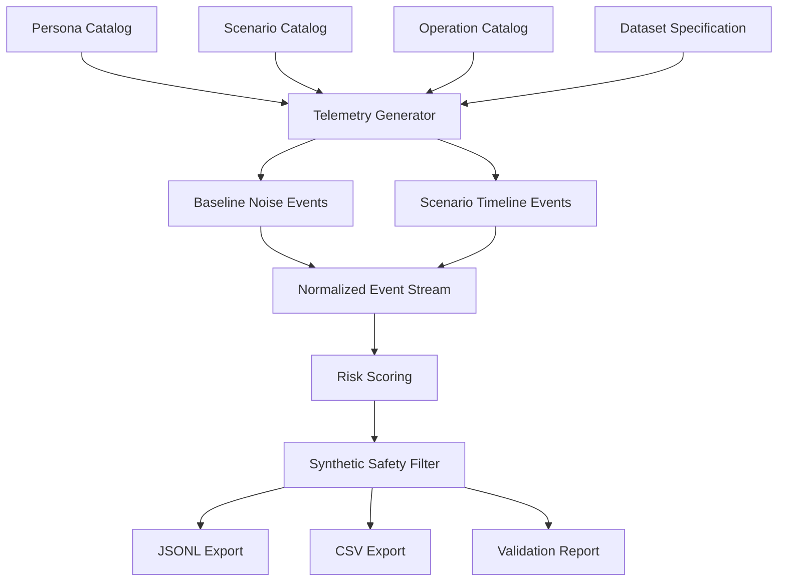

---

## Replay Engine Flow

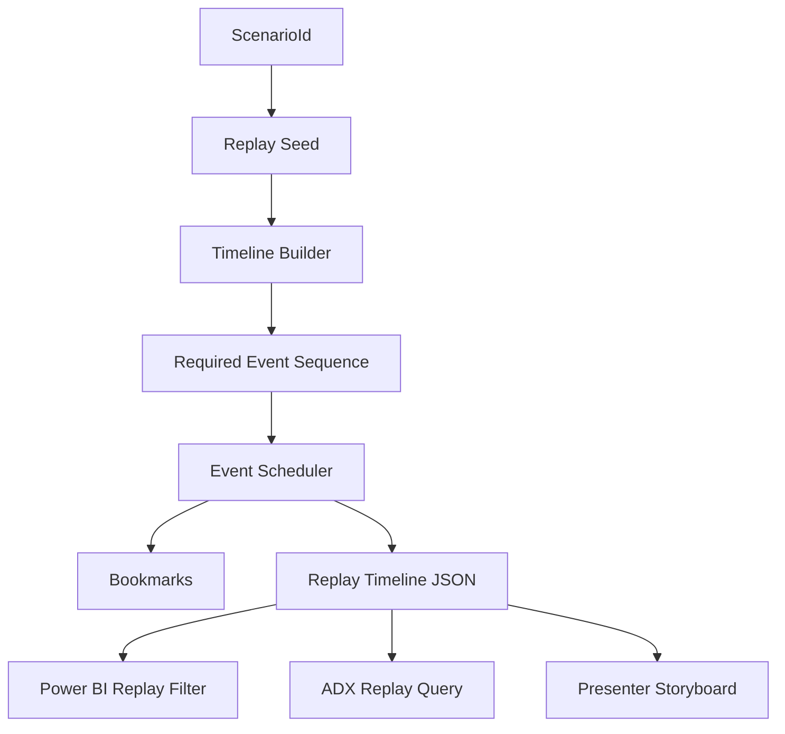

### Replay Keys

```text
ReplayId
ScenarioId
CorrelationId
UserPrincipalName
FileName
TimeGenerated
```

---

## Browser-Agent Future Flow

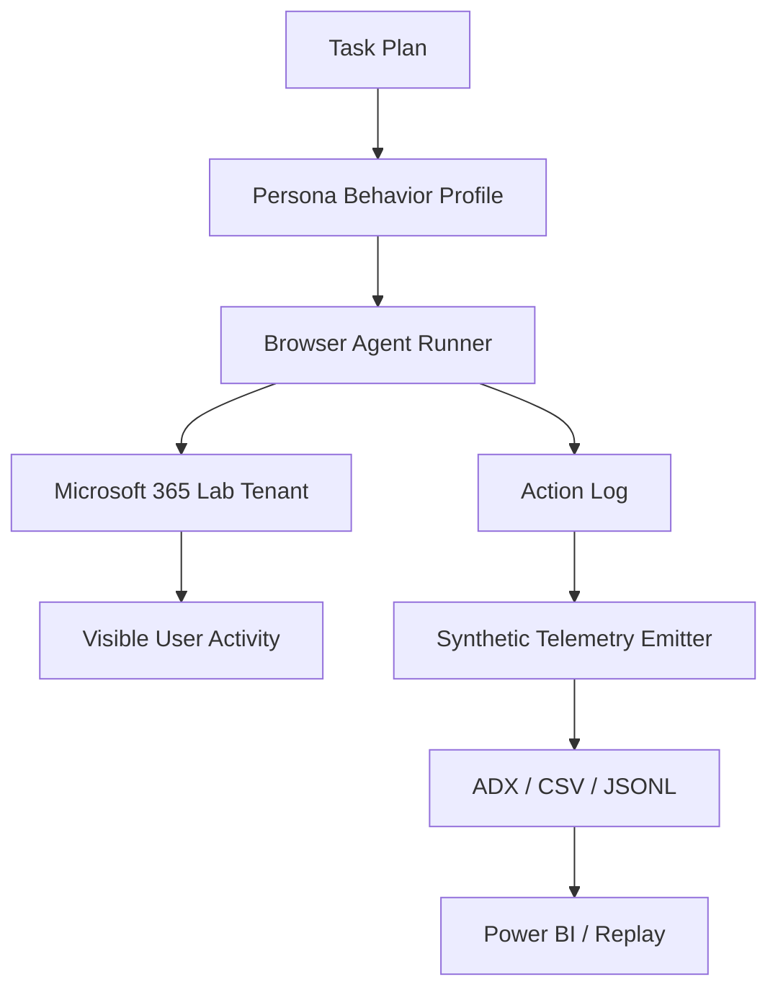

### Important

Browser agents are future-state and should not be implemented before the MVP telemetry generator, validation, and Power BI-ready dataset are stable.

---

## ADX Ingestion Flow

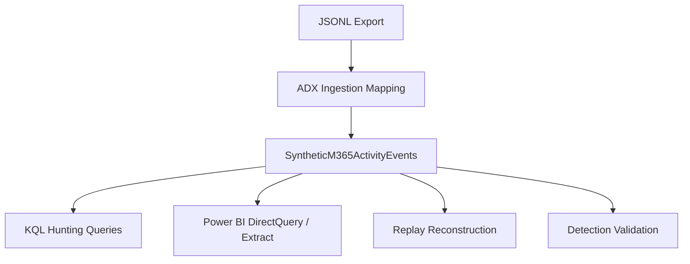

---

## Power BI Consumption Flow

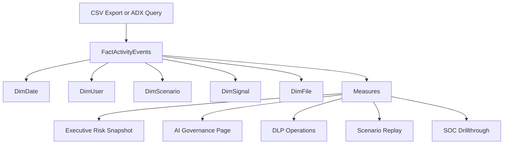

---

## Sentinel Future Enrichment Flow

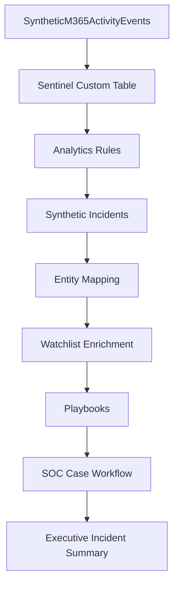

---

## AI Governance Flow

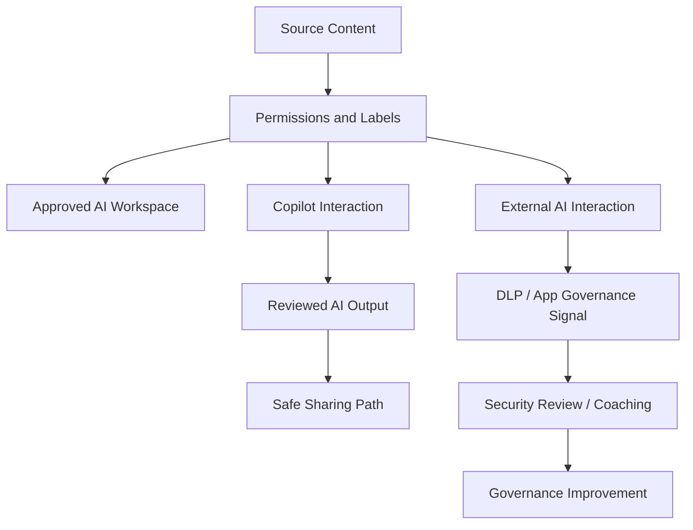

---

## Validation Pipeline Flow

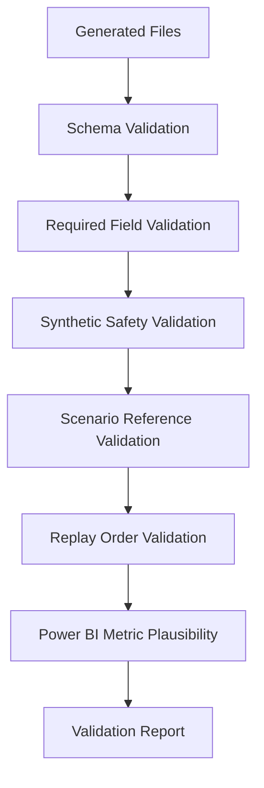

---

## CI/CD Future Flow

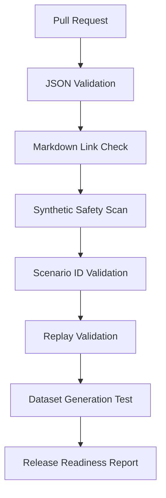

---

## Trust Boundaries

| Boundary | Description | Rule |
|---|---|---|
| Synthetic Data Boundary | generated data is fictional only | never import production data |
| Lab Tenant Boundary | browser agents operate only in lab/demo tenant | never automate production tenants |
| Repository Boundary | repository stores only synthetic examples and code | no credentials or real secrets |
| External Sharing Boundary | external recipients are fake/test domains | no real customer or vendor data |
| AI Boundary | AI prompts use synthetic or sanitized content only | no real sensitive prompt content |
| Investigation Boundary | cases are fictional | no real employee monitoring |

---

## Synthetic Data Boundary Controls

Required controls:

```text
IsSynthetic = true on every event
approved fictional prefixes only
fake/test domains only
no real addresses
no real credentials
no production URLs
validation report generated for each dataset
synthetic disclaimer in dashboards and docs
```

---

## Deployment Topology - Offline MVP

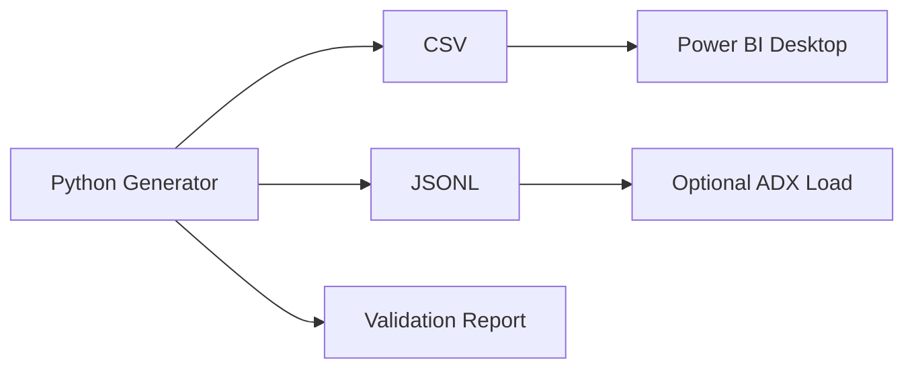

Best for:

- first MVP
- executive demo
- safe offline storytelling
- development validation

---

## Deployment Topology - Cloud-Connected Demo

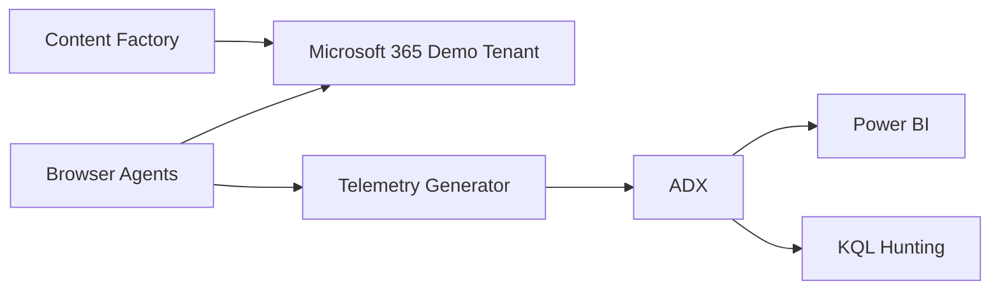

Best for:

- technical workshops
- Purview demo scenarios
- visible browser-based activity

---

## Deployment Topology - Future SOC Cyber-Range

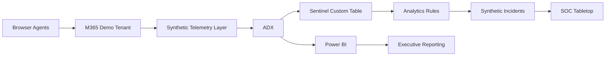

Best for:

- SOC training
- MDR/MXDR demos
- cyber-range exercises
- multi-day replay

---

## Component Ownership

| Component | Owner Role |
|---|---|
| Content Factory | Content Engineer |
| Persona and Scenario Catalog | Scenario Designer |
| Telemetry Generator | Data Engineer |
| Validation Pipeline | Platform Maintainer |
| ADX / KQL | Detection Engineer |
| Power BI | BI Developer |
| Replay Engine | Simulation Engineer |
| Browser Agents | Automation Engineer |
| Sentinel Layer | SOC Architect |
| AI Governance Layer | AI Governance Lead |
| Commercialization | Services Lead |

---

## Future-State Architecture

Future architecture should support:

```text
autonomous persona agents
multi-tenant federation
Sentinel incident automation
Defender XDR enrichment
Microsoft Fabric lakehouse analytics
replay APIs
Power BI embedded storytelling
scenario marketplace
industry-specific scenario packs
managed governance reporting
```

These should remain future-state until the MVP dataset, validation pipeline, ADX ingestion, and Power BI dashboards are stable.

---

## Codex Usage Guidance

Codex should use this file to:

1. Understand component flows before implementing code.
2. Generate architecture diagrams from Mermaid blocks.
3. Preserve trust boundaries.
4. Place outputs in the correct architecture layer.
5. Avoid building future-state components before MVP dependencies exist.
6. Map implementation tasks to component responsibilities.
7. Update diagrams when major architecture changes occur.
8. Preserve synthetic-only boundaries.

---

## Safety Reminder

This architecture is for synthetic demo, simulation, and advisory use only.

Do not connect it to production tenants, production telemetry, real users, real customers, real HR records, real legal matters, real financial data, real credentials, real secrets, or real incident evidence.
