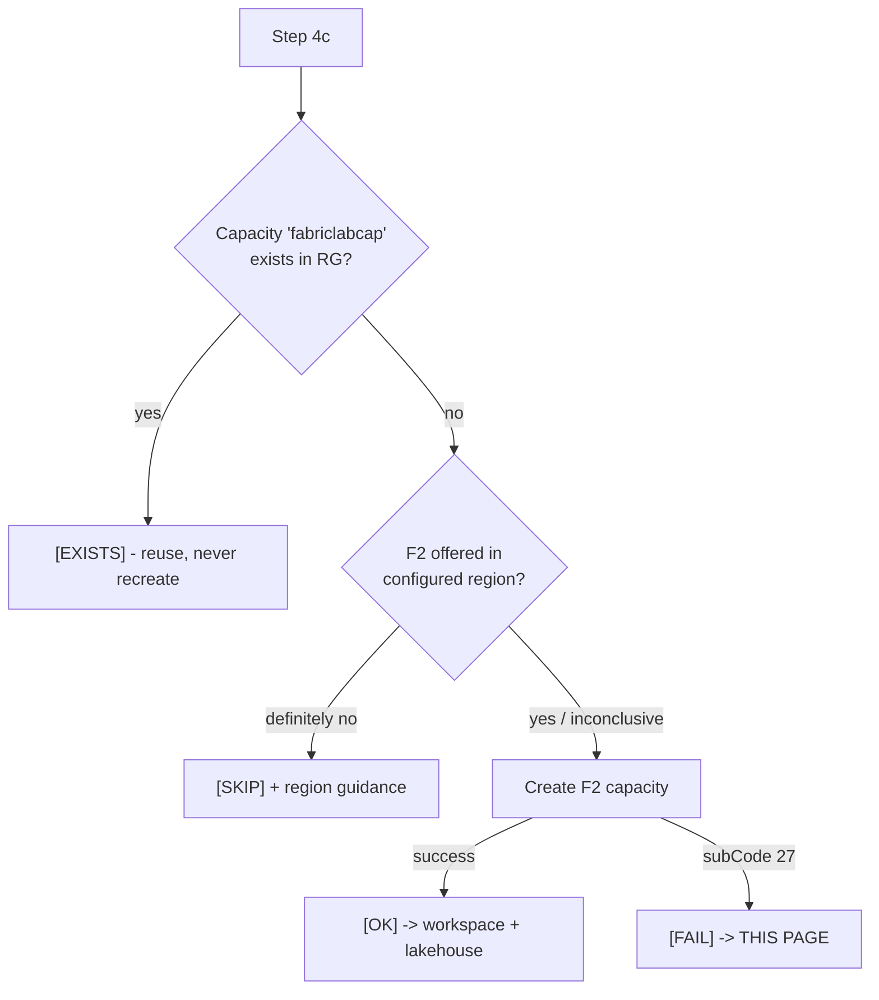

# Enabling Microsoft Fabric for the Tenant (Step 4c)

Step 4c provisions a **Microsoft Fabric F2 capacity**, workspace, and lakehouse for
the lab's Engineering data platform. Fabric is **optional** - the rest of the lab
runs without it - but if you want the Activity Story Map / data-platform scenarios,
the tenant must first be **enabled for Microsoft Fabric**.

This page explains the one error you may hit, **why the installer cannot fix it
automatically (even as Global Admin)**, and the supported ways to enable it.

---

## The symptom

During Step 4c the installer prints:

```
Creating Fabric capacity 'fabriclabcap' (F2)... [FAIL]

    ============================================================
    FABRIC NOT ENABLED ON THIS TENANT (manual one-time action)
    ============================================================
    Cause:  Microsoft Fabric has never been enabled for tenant
            <your-tenant>.onmicrosoft.com (Azure error subCode 27).
    ...
```

The underlying Azure Resource Manager error is:

```
BadRequest, subCode 27:
"Tenant '...' wasn't recognized by Microsoft Fabric.
 Sign up for Microsoft Fabric and try again."
```

> This is **not** a region problem. F2 is available in ~59 regions including
> East US; the installer verifies regional availability separately and will say so.
> `subCode 27` specifically means the **tenant has never been onboarded to Fabric**.

---

## Why the installer (and even a Global Admin) can't do it non-interactively

Enabling Fabric is **not** an Azure Resource Manager (ARM) operation. It lives on a
different control plane:

| Plane | Used for | Token the installer holds |
| --- | --- | --- |
| **ARM / Azure RBAC** | Create `Microsoft.Fabric/capacities` (the F2 capacity) | Yes (Owner/Contributor) |
| **Microsoft Graph / Entra / EXO** | Users, Conditional Access, DLP policies | Yes (Global Admin) |
| **Power BI / Fabric Admin API** | **Enable Fabric for the tenant** (`api.fabric.microsoft.com/v1/admin/tenantsettings`) | **No** |

The Fabric Admin API requires a **delegated token with the `Tenant.ReadWrite.All`
scope, admin-consented to the calling application**. The Azure CLI's built-in
first-party application does **not** carry that scope, so a call to the admin API
returns **HTTP 401** - even when the signed-in user is a Global Administrator.

In other words: **Global Admin grants the authority, but the installer has no token
on the right plane to exercise it.** First-time Fabric sign-up also historically
requires an interactive bootstrap (visiting Fabric / starting a trial) that has no
unattended ARM/CLI equivalent. The installer therefore **detects this case,
explains it clearly, and continues** (Fabric is optional).

---

## Option A - Portal (recommended, 2 minutes)

Do this **once** as a Fabric / Power BI administrator, then rerun Step 4c.

1. Go to **https://app.fabric.microsoft.com** and sign in as a tenant admin
   (Global Admin, Power BI Admin, or Fabric Admin).
2. Open **Settings (gear icon) -> Admin portal -> Tenant settings**.
3. Under **Microsoft Fabric**, set **"Users can create Fabric items"** (and the
   parent **"Microsoft Fabric"** toggle) to **Enabled** for the organization
   (or a specific security group that includes your lab admin).
4. *(If you have no Fabric capacity yet)* you can also **start a Fabric trial**
   from the same portal to bootstrap tenant onboarding.
5. Wait **5-10 minutes** for the setting to propagate.
6. Rerun Step 4c:

   ```powershell
   $env:CLAUDIA_TENANT = 'contoso'
   pwsh -File .\Install-ClaudIA.ps1 `
     -ConfigPath '.\config\tenants\contoso.json' `
     -Step 4 -SkipPrerequisites
   ```

Alternative admin surface: **https://admin.powerplatform.microsoft.com** (enable the
Fabric / Power BI service for the tenant).

---

## Option B - CLI / REST (scriptable, requires a consented app)

This is the **vibecode-supported** path: it works, but it is **not free of setup**.
You must use an **app registration that has the Power BI Service
`Tenant.ReadWrite.All` delegated permission with admin consent** (the az CLI's own
app does not). Do this once, then it is repeatable.

### B.1 One-time: grant an app the admin scope

1. In **Entra admin center -> App registrations**, pick (or create) an app and add
   an **API permission**: **Power BI Service -> Delegated -> `Tenant.ReadWrite.All`**.
2. Click **Grant admin consent** for the tenant.
3. Ensure the signing-in user is a **Fabric Administrator** (or Global Admin).

> Why a custom app: enabling Fabric tenant settings is a privileged admin-plane
> action. Granting `Tenant.ReadWrite.All` is itself an admin-consented decision, so
> the lab installer intentionally does **not** ship such an app - you opt in here.

### B.2 Acquire a Fabric-scoped token (delegated, via that app)

```powershell
# Interactive delegated sign-in against your consented app:
az login --tenant <tenantId> --scope https://analysis.windows.net/powerbi/api/.default
$token = az account get-access-token `
  --resource https://api.fabric.microsoft.com `
  --query accessToken -o tsv
```

### B.3 Enable the Fabric tenant setting

```powershell
$headers = @{ Authorization = "Bearer $token"; 'Content-Type' = 'application/json' }

# Read current settings (confirms your token has admin access; should be HTTP 200):
Invoke-RestMethod -Method GET `
  -Uri 'https://api.fabric.microsoft.com/v1/admin/tenantsettings' `
  -Headers $headers

# Enable "Users can create Fabric items" tenant-wide:
$body = @{ enabled = $true } | ConvertTo-Json
Invoke-RestMethod -Method POST `
  -Uri 'https://api.fabric.microsoft.com/v1/admin/tenantsettings/FabricEnabled/update' `
  -Headers $headers -Body $body
```

> Setting names and the exact update route can vary by tenant/API version. If a
> route 404s, list settings with the GET call above and use the `settingName` that
> matches **Microsoft Fabric** in the response. If the GET itself returns **401**,
> your token still lacks `Tenant.ReadWrite.All` admin consent - revisit B.1.

### B.4 Verify, then rerun Step 4c

```powershell
# Capacity SKU availability (sanity check; F2 is broadly available):
az rest --method get `
  --uri "https://management.azure.com/subscriptions/<subId>/providers/Microsoft.Fabric/skus?api-version=2023-11-01"

# Rerun the Fabric step:
pwsh -File .\Install-ClaudIA.ps1 `
  -ConfigPath '.\config\tenants\<TenantKey>.json' `
  -Step 4 -SkipPrerequisites
```

---

## After enablement: what Step 4c does on the next run



- If the capacity already exists -> **`[EXISTS]`** (no recreate).
- If the tenant is now Fabric-enabled -> capacity is created **`[OK]`**, then the
  workspace `CorpLab-DataPlatform` and lakehouse `LakehouseCorpLab` are provisioned.
- If still not enabled -> **`[FAIL]`** with the message that links back here, and the
  installer continues (Fabric is optional).

---

## Quick reference

| Question | Answer |
| --- | --- |
| Is a region change needed? | No. F2 is available in East US and ~59 regions. |
| Can the installer auto-enable Fabric? | No - it lacks a `Tenant.ReadWrite.All` token on the Fabric admin plane. |
| Does Global Admin alone fix it? | It authorizes you, but you must act on the **Fabric admin plane** (portal or a consented app), not via the installer's ARM/Graph tokens. |
| Is Fabric required for the lab? | No - it is optional; everything else deploys without it. |
| Fastest path? | Portal (Option A): enable Fabric tenant setting, wait ~10 min, rerun Step 4c. |
